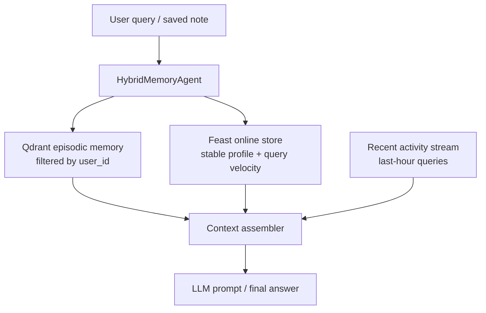

# Bonus Architecture - Hybrid Memory Assistant

Contributors: Nguyễn Trọng Dũng

This POC uses the lab's existing Vietnamese corpus (`data/corpus_vn.jsonl`) and
the Feast outputs already produced by the core lab. I intentionally do not add a
new synthetic dataset. The point is to show how episodic memory, stable profile,
and recent activity fit together, not to invent another benchmark.

## Architecture

The split is deliberate. Episodic memory answers "what have I seen?", Feast
answers "who is this user?", and the live activity stream answers "what just
happened?". The final prompt is assembled from all three so the assistant can
answer with grounding plus personalization.

## Decision 1: Chunking strategy

I chunk episodic memory per semantic paragraph, capped at roughly 120 words with
a small overlap. I considered three alternatives:

- Per-message chunks
- Whole-document chunks
- Semantic/paragraph chunks

I chose paragraph chunks because they are a middle ground. Per-message is too
small: it fragments context and raises retrieval noise when a user's note spans
multiple sentences. Whole-document is too large: it saves storage but wastes
context window and makes recall less precise. Paragraph chunks keep the storage
cost reasonable while still letting Vietnamese paraphrases hit a compact unit of
meaning.

For this POC, the memories come from real lab corpus documents such as cloud
and security articles. That gives the demo actual text to retrieve, not fake
placeholder notes.

## Decision 2: Feature schema

The stable profile uses tabular features, not embeddings:

- `reading_speed_wpm` - entity `user_id`, TTL 30 days, source: Feast parquet
- `preferred_language` - entity `user_id`, TTL 30 days, source: Feast parquet
- `topic_affinity` - entity `user_id`, TTL 30 days, source: Feast parquet
- `queries_last_hour` - entity `user_id`, TTL 1 hour, source: Feast online store
- `distinct_topics_24h` - entity `user_id`, TTL 1 hour, source: Feast online store

I considered storing profile as an embedding derived from history, but rejected
it. Embeddings are good for similarity, yet bad for explainability and TTL
reasoning. A tabular profile is easier to inspect, easier to refresh, and easier
to debug when a recommendation feels wrong.

This choice also matches the lab: Feast is strongest when the features are low-
cardinality, versioned, and easy to materialize separately from vector memory.

## Decision 3: Freshness strategy

Freshness is split by use case:

- **Sub-second** for recent activity. The assistant records each new query into
  a live stream so "what am I focused on lately?" changes immediately.
- **Daily** for stable profile. Reading speed, language preference, and topic
  affinity do not need second-level freshness.
- **Immediate insert, periodic consolidation** for episodic memory. A new note
  should be searchable right away, but older notes can later be merged into a
  summary if the collection grows.

I considered batch-refreshing everything every few minutes, but that is a poor
fit for personal memory. Recent activity would feel stale, while stable profile
would waste compute if refreshed too often.

## One alternative I rejected

I considered putting episodic memory directly into the feature store as another
feature view. I rejected that design because the update cadence is wrong.
Episodic memory grows in high-cardinality chunks and must support similarity
search. A feature store is better for stable, low-cardinality attributes that
are fetched by key. Keeping the two systems separate avoids forcing a single
storage model to serve two different jobs.

## Vietnamese-context considerations

Vietnamese queries in the lab mix diacritics, English terms, and code-switching
(`cloud`, `Kubernetes`, `security`, `mã hoá`). A whitespace tokenizer is fine
for the demo because the corpus is already normalized and many important terms
are standalone tokens. In production I would still test `pyvi` or
`underthesea`, but only after measuring whether they help more than they hurt.
Over-tokenizing English acronyms can damage recall on mixed vi/en queries.

## What this POC does not handle yet

This POC does not implement encryption at rest, deletion workflows, multi-device
sync, or per-user key management. It also does not solve full memory decay,
summary consolidation, or compliance logging. Those are the next steps if the
prototype becomes a real personal assistant.

